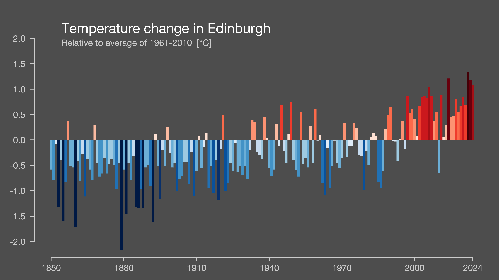
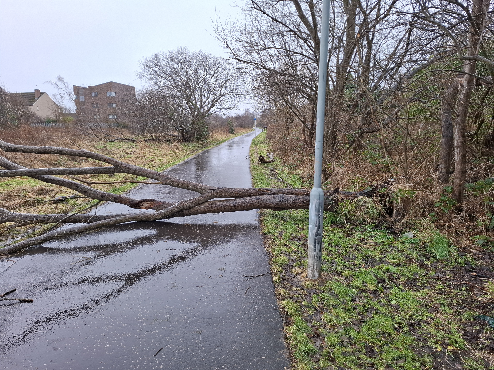
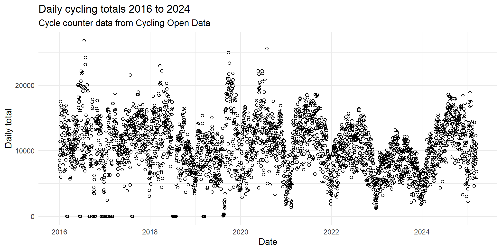
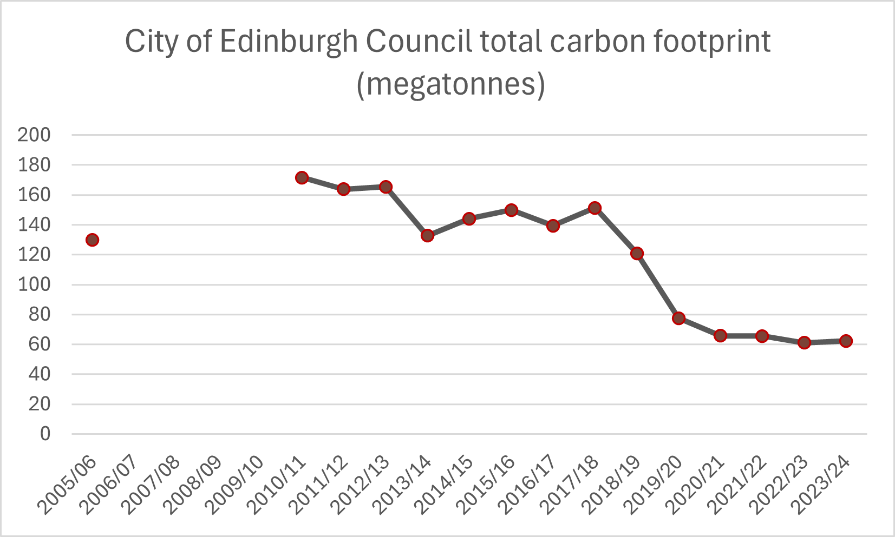
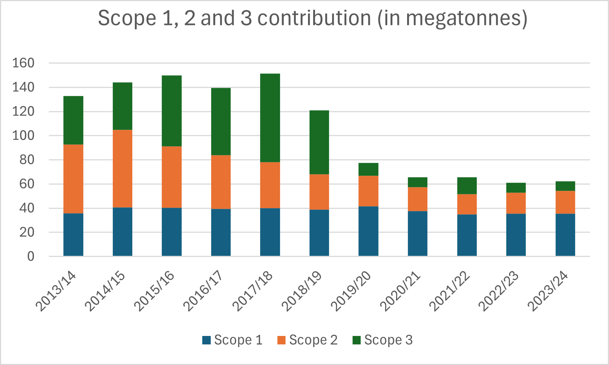

### Analysis By the Collective: D4CAE (Data for Climate Action Edinburgh)

[{fig-alt="The D4CAE logo depicting people using laptops, a tree, a bee and weather symbols"}](https://data-4-climate-action-edinburgh.github.io/home/)

Published: v1.1 22 May 2025

# Introduction

## Scope

The aim of this report is to present key data on climate action happening, and climate impacts on, the city of Edinburgh in Scotland. We hope that by raising awareness of local effects of climate change, we can contribute to the impetus to support climate action. And that we can highlight ongoing climate action, that gives us hope.

As the output of a small voluntary local group, D4CAE, the scope of this report is modest, addressing a handful of aspects of climate action and climate impacts. This year's report, being the very first year, in some ways focuses mainly on finding and documenting data sources, and establishing tools for data extraction, and establishing baselines for some data.

## Open access

This report is an open science project - the data, code and text are all being produced in a publicly available repository on GitHub:

<https://github.com/data4climateactionedinburgh/abcd_2025>

Any amendments will be visible in this same GitHub repo, as commits, in the normal Git version control way. This report file, the text, and all the files in the repository are made available under a Creative Commons Zero v1.0 licence, except of course those subject to ownership by the respective data providers. The files created by D4CAE are thus placed in the public domain, and may be copied, adapted and redistributed without condition. If you wish to cite this work, please cite Data 4 Climate Action Edinburgh as the author.

The charts, the references, the associated code, all available in the D4CAE ABCD_2025 GitHub repo, form a resource available to all free of charge, free of conditions. There are probably errors in this document, the code and the data. Please contact us if you find any, so that we can learn from you. This kind of crowd-sourced quality control and collaboration is the driving force that propels Open Science forward. 

Finding this climate data and using it has taken a lot of work. Some datasets were lacking in documentation, some were not openly-licensed, despite being produced using public money. Data reusability is an area where Scotland and the UK can do better - make it FAIR, findable accessible interoperable and reusable. To be specific, while it was a good choice to use the very sustainable NetCDF format for the Hadley centre temperature data, containing plenty of metadata in a standard structure, the red tape to access the data through the CEDA website could have been removed. Furthermore the complex nature of the data, and the specific geospatial grid used for the UK, meant that this data was not feasible to extract and plot onto a graph, even for a volunteer with a high level of coding skill. Hence there's no graph in this version of this report for the daily temperature throughout 2024. A single tutorial, or link to an exemplar publication providing open code for extracting data by location would have made the data reusable. If we find such a resource, we'll include it in next year's report. The SEPA flooding maps are impossible to share, let alone adapt, because of licensing barriers. This is an old-fashioned approach, locking up the data under commercial intellectual property rights. Must do better. 

## About the group

D4CAE was set up by Pauline Ward, who is also the main contributor to this report. You can find our blog and contact details on our website:

<https://data-4-climate-action-edinburgh.github.io/home/>

Over the course of the past couple of years, we've explored a range of different projects, some may not have resulted in any visible output, such is the nature of citizen science. However, the group has built good relationships with stakeholders in Edinburgh's climate action scene and has completed several projects successfully for example: - supported ECCAN to process member data, and to select software for this purpose; - provided data visualisations of survey data to EBRIC (Edinburgh Building Retrofit and Improvement Collective), which they used in a published report.

As for 2025 work, Pauline is currently producing a simplified carbon footprint at the request of one of ECCAN's member charities (Fountainbridge Canalside Community Trust). Details will appear on the [D4CAE blog](https://data-4-climate-action-edinburgh.github.io/home/) in due course. Sincere thanks go to the team delivering the excellent and very enjoyable [Climate Springboard course at the Edinburgh Climate Change Institute](https://edinburghcentre.org/projects/climate-business-leaders), which has been essential to that work.

# In a nutshell

Our city is a full degree warmer on the thermometer than just a few decades ago. Such a change inevitably affects our ecosystems profoundly. And the line is only just starting to plateau. Sustained climate action is required. The sections on ECCAN and the City of Edinburgh Council highlight serious efforts being made throughout the communities of Edinburgh to reduce Edinburgh's carbon footprint.

# Environment

## Temperature

### Present day: 2024 

The Met Office [annual summary of 2024](https://www.metoffice.gov.uk/binaries/content/assets/metofficegovuk/pdf/weather/learn-about/uk-past-events/summaries/annual_assessment_2024.pdf) temperature map shows Edinburgh and the surrounding area categorised as being in the '0.5 to 1.0 degrees celsius anomaly' (ie temperature increase) relative to the 1991 to 2020 period. The report is "a provisional assessment of the weather experienced across the UK during 2024 and how it compares with the 1991 to 2020 average".

### Long-term Projection: 2070
According to the Met Office's Local Climate Action Tool, the projected temperature increase for the City of Edinburgh, is 2.83 degrees celsius by 2070, based on current policies.

Source: [Local Climate Adaptation Tool](https://www.lcat.uk)

### Annual temperatures from 1850 - 2024

The temperature change in Eastern Scotland has been visualised in the form of climate stripes (invented by Ed Hawkins, see references - University of Reading) - see below: the Edinburgh climate stripes chart (CC-BY University of Reading).

[{fig-alt="Bar chart depicting average temperature in Edinburgh rising from 1850 to 2024"}](https://showyourstripes.info/)

We can see from the chart that the temperature in Edinburgh for the whole of the year 2024 was 1.0 degrees celsius above the 1961-to-2010 baseline. We can also see that just two years earlier, Edinburgh's temperature reached an all-time high that was 1.3 degrees above the same baseline. This 1961-2010 baseline was already more than 0.6 degrees warmer than pre-industrial levels. Putting this all together, we can say: Our city is a full degree warmer on the thermometer than just a few decades ago. Such a change inevitably affects our ecosystems profoundly. And the line is only just starting to plateau. Sustained climate action is required.

A word on data visualisation style: The bar chart above uses the vertical axis, making the scale of the temperature rises clear. Whereas, seen below, the classic climate stripes, such an iconic, distinctive and memorable dataviz, uses only the colour and shading of the bars to depict the temperature change for Scotland as a whole.

[{fig-alt="Warming strips depicting rising average temperatures in Scotland"}](https://showyourstripes.info/s/europe/unitedkingdom/scotland)

## Rainfall

The Met Office LCAT tool shows that by 2030, under the existing policies, Edinburgh's average rainfall will be 2.37mm per day - that is a whopping 11.8% higher than the 1980 level of 2.12mm per day.

[{fig-alt="Bar chart showing rainfall in 1980 at 2.12mm per day, 2030 at 2.37mm per day, 2040 at 2.16, 2050 at 2.03, 2060 at 2.17 and 2070 at 2.12mm per day."}](https://www.lcat.uk/)

## Flood risk

While [flood risk maps are available to view via the website of the Scottish Environment Protection Agency SEPA](https://scottishepa.maps.arcgis.com/apps/webappviewer/index.html?id=3098bbef089c4dd79e5344a0e1e7c91c&showLayers=FloodMapsBasic_2743;FloodMapsBasic_2743_1;FloodMapsBasic_2743_2;FloodMapsBasic_2743_3;FloodMapsBasic_2743_5;FloodMapsBasic_2743_6;FloodMapsBasic_2743_7;FloodMapsBasic_2743_9;FloodMapsBasic_2743_10;FloodMapsBasic_2743_11;FloodMapsBasic_2743_12;FloodMapsBasic_2743_13;FloodMapsBasic_2743;FloodMapsBasic_2743_1;FloodMapsBasic_2743_2;FloodMapsBasic_2743_3;FloodMapsBasic_2743_5;FloodMapsBasic_2743_6;FloodMapsBasic_2743_7;FloodMapsBasic_2743_9;FloodMapsBasic_2743_10;FloodMapsBasic_2743_11;FloodMapsBasic_2743_12;FloodMapsBasic_2743_14) , it has not been possible to include a copy here, nor in a video, as they are copyright, and the copyright is owned by Ordnance Survey, and copying is strictly prohibited - see https://flood-map-for-planning.service.gov.uk/os-terms .

SEPA's Flood Maps show some alarming features:

-   a high level of surface water flooding risk around Waverley train station and many other areas across the city of Edinburgh ('high likelihood' defined as a 10% risk in a given year).

-   a high level of river flood risk along the River Almond ('high' means 10% likelihood).

-   a high level of coastal flooding risk (ie 10% in a given year) along the entirety of the shoreline of the Firth of Forth, from South Queensferry, through Leith, right along to Musselburgh.

(SEPA Flood Maps)

Increasing rainfall will increase the risk of surface water flooding and river flood risk.

Rising sea levels will increase the risk of coastal flooding.

Further details on how to use SEPA Flood Maps can be found in the [Methods section Methods.html](https://github.com/search?q=repo%3Adata4climateactionedinburgh%2Fabcd_2025%20Methods.html&type=code).

## Extreme weather - Storm Eowyn

Storm Eowyn tested Edinburgh’s resilience on Friday 24 January 2025, with a Met Office Red Weather Warning seeing the city's schools, supermarkets, offices and bus routes shut down for the best part of a day. The people of Edinburgh as a whole did the right thing, following the official advice and staying at home, to protect themselves and others across our communities, and to allow those who needed to continue their work, out and about across the city, to be as safe as possible. Our thoughts are with the family of the young man in Ayrshire, killed by a falling tree several hours before the red warning was even in place. 

We saw numerous trees brought down or damaged across Edinburgh by Storm Eowyn. The Botanics alone lost fifteen trees. Paths were blocked. By and large, council services did a very good job of swiftly finding and tackling fallen trees, clearing paths. It is a natural part of the carbon cycle that trees are brought down by storms. It’s most important we replace them by planting new ones, the right tree in the right place, to support our pollinators and bird life, and taking care of them properly to ensure they grow. They must be replaced with species that are resilient to the changes we continue to see in our climate, and that support local ecosystems and flood defences. 

{fig-alt="fallen tree completely blocking path"}

Since the storm took place in 2025, technically it is outside the scope of this report and will feature in next year's report. However it would have seemed absurd to ignore such an extraordinary and dangerous weather event in this year's publication. 

# Travel

Active travel such as cycling helps reduce greenhouse gas emissions.

The scatter plot below shows higher counts in 2024, compared to 2022 and 2023, suggesting there was an increase in the level of cycling in the city.

Cycle counter data provides us with a sample of the bicycle journeys taken. There are a large number of cycle counters across the city, provided by City of Edinburgh Council. The data is available under an open licence from [Cycling Open Data's usmart site](https://usmart.io/org/cyclingscotland/).

The chart of the total from all sixty counters in Edinburgh shows the number of bicycles recorded fluctuates with the seasons, peaking each summer and dropping in the winter. The locations are listed on our GitHub repo: <https://github.com/data4climateactionedinburgh/abcd_2025/blob/main/open_data/travel/README_COD.md>

This data visualisation was coded in R (by Pauline) using the ggplot package - the code is available on our GitHub repo, along with a copy of the downloaded data: <https://github.com/data4climateactionedinburgh/abcd_2025/blob/main/code/active_travel.R>

{fig-alt="Scatter plot showing cycling total for all counters in Edinburgh."}

Data from Spokes confirms the upward trend: "The biannual Spokes city-centre and Porty traffic counts, on Tuesday 11 November found bikes up almost everywhere compared to November 2023 – though mostly not by large amounts. In the city centre morning rush hour bikes were up 4% from 365 to 381, and at lunchtime up 17% from 156 to 183. In Porty, totalling morning and lunchtime, bike numbers were up a huge 36%, albeit from the low base of 70, to 95. Whilst it is great to see numbers rising at our traditional city centre on-road count locations,\* it is notable that Cycling Scotland’s automatic counters have found much greater increases in bike numbers at locations where new bike infrastructure is in place"

[Nov Traffic Count: bikes up, but more if new infra](http://www.spokes.org.uk/2024/11/nov-traffic-count-bikes-up-but-more-if-new-infra/)

# Climate action

## ECCAN

ECCAN is the Edinburgh Communities Climate Action Network. For the first time, ECCAN has gathered a full year's data on their engagement and support work with their member charities and other voluntary organisations.

ECCAN key stats for the year 1 April 2024 to 31 March 2025:

-   12 Climate Champions trained
-   150 groups belong to ECCAN as members
-   294 people belong to ECCAN as individual members
-   898 new subscribers to the newsletter

The team has also gathered more than twenty-five questionnaire responses over the past six months, and these showed respondents found that their involvement with ECCAN over the preceding year had increased their (or their organisation's) capacity and confidence in dealing with the climate emergency, as well as supporting them to change their practices and develop skills.

## City of Edinburgh Council

The CEC is a funder and close working partner of ECCAN. The council's 2023/2024 climate duties report provides the following statement on the approach and governance in place with respect to climate change:

"The City of Edinburgh Council declared a climate emergency in February 2019, set a new target for the city to be net zero by 2030 and declared a nature emergency in 2023. To achieve this net zero target and adapt the city to the impacts of climate change, a 2030 Climate Strategy and Implementation Plan was approved in November 2021. The Strategy contains Council and citywide governance and reporting structures and strategic actions to achieve the 2030 net zero target and adapt the city. A Council Emissions Reduction Plan (CERP) (approved November 2021) outlines a phased action plan for reducing Council corporate emissions emissions. A CERP Board, established in 2022, provides strategic leadership and operational accountability for delivery of the Council’s organisational emissions target of net zero by 2030. It is chaired by the Service Director for Sustainable Development and includes Council’s key service areas for each of the strands of the plan (Buildings, Fleet, Waste, Human Resources and Procurement)."

Unfortunately we didn't have as much time to dig into the detail of this as we'd like for this year. New Low Traffic Neighbourhoods (LTNs) in Corstorphine (now in place) and Leith (in development) promise to deliver reductions in the city's transport carbon footprint in the coming years.

The series of climate reports about the council are available from the Sustainable Scotland Network, the latest at the time of writing is for 2023-2024: <https://sustainablescotlandnetwork.org/reports/city-of-edinburgh-council> 
... these spreadsheets appear to comprise the council's Public Sector Report on Compliance with Climate Change Duties. The figures in the file represent Scope 1, 2 and 3 emissions for the city. In other words this is a carbon footprint calculation, as per the [Greenhouse Gas Protocol](https://ghgprotocol.org/). It is designed to drive improvement. It should not be assumed that reported totals from one year to the next will always fall, since planned emission reduction actions may depend on infrastructure development, and may be influenced by changing energy requirements and so on. Nonetheless, the figures in the 2023/24 report go back to 2005, allowing us to show the trends. 

The council's overall carbon footprint, according to the figures, was brought down sharply between 2017 and 2020, but has stagnated, flatlining for the most recent four years. 

Scope 1 emissions are those very directly under the control of the organisation, while scopes 2 and 3 are indirect emissions caused by the organisation's activities. The chart shows clearly the scope 1 emissions have not reduced substantially since 2013 when they were first measured. Whereas major reductions were seen in scopes 2 and 3 between 2014 and 2019 but since 2020 there has been almost no progress. A disappointing trend, to say the least. 

# Conclusion

This emphasis of this report is on providing a baseline set of figures rather than showing trends and analysis. 

The picture painted here is concerning. Edinburgh's climate is changing. The carbon footprint of the city is not falling as quickly as it should be. 

However, there is a power of work being done by volunteers, by the ECCAN network, by the Council and by businesses and the voluntary sector to reduce greenhouse gas emissions. That work needs continued support from funders. And it needs us all to keep the light of optimism in our hearts. 

{fig-alt="bright sunny view of blue sky over Edinburgh Castle and Princes Street Gardens"}

# References

Met Office (2025) "Annual Assessment - 2024" <https://www.metoffice.gov.uk/binaries/content/assets/metofficegovuk/pdf/weather/learn-about/uk-past-events/summaries/annual_assessment_2024.pdf>

LCAT - Local Climate Adaptation Tool, University of Exeter, Then Try This, Cornwall Council and The Alan Turing Institute
<https://www.lcat.uk>

Met Office Local Authority Climate Explorer Beta v1.0
<https://themetoffice.maps.arcgis.com/apps/dashboards/506ff7d53c884badb0d8fd36d6280a91>

SEPA Flood Maps: SEPA gratefully acknowledges the cooperation and input that various parties have provided, including inter alia, the following organisations:

> Ordnance Survey\
> Flood maps are based upon Ordnance Survey material with the permission of Ordnance Survey on behalf of the Controller of Her Majesty’s Stationery Office © Crown Copyright. Any unauthorised reproduction infringes Crown copyright and may lead to prosecution or civil proceedings. SEPA Licence number AC0000825128 (2025).
>
> The Centre for Ecology and Hydrology Some features of these maps are based upon digital spatial data licensed from the Centre for Ecology and Hydrology © NERC (CEH) and third party licensors.
>
> The Met Office Data provided by The Met Office has been used under licence in some areas of flood risk information production. ©Crown Copyright (2019), the Met Office.
>
> The James Hutton Institute Data provided under licence from the James Hutton Institute has been applied in production of flood risk management information. Copyright © The James Hutton Institute and third party licensors.
>
> British Geological Survey Flood risk information has been derived from BGS digital data under licence. British Geological Survey © NERC
>
> Local authorities SEPA acknowledges the provision of flood models and other supporting data and information from local authorities in Scotland and their collaboration in the production of flood risk management information.
>
> Scottish Water SEPA acknowledges the inclusion of surface water flooding data generated by Scottish Water in preparation of flood risk information

<https://scottishepa.maps.arcgis.com/apps/webappviewer/index.html?id=3098bbef089c4dd79e5344a0e1e7c91c&showLayers=FloodMapsBasic_2743;FloodMapsBasic_2743_1;FloodMapsBasic_2743_2;FloodMapsBasic_2743_3;FloodMapsBasic_2743_5;FloodMapsBasic_2743_6;FloodMapsBasic_2743_7;FloodMapsBasic_2743_9;FloodMapsBasic_2743_10;FloodMapsBasic_2743_11;FloodMapsBasic_2743_12;FloodMapsBasic_2743_13;FloodMapsBasic_2743;FloodMapsBasic_2743_1;FloodMapsBasic_2743_2;FloodMapsBasic_2743_3;FloodMapsBasic_2743_5;FloodMapsBasic_2743_6;FloodMapsBasic_2743_7;FloodMapsBasic_2743_9;FloodMapsBasic_2743_10;FloodMapsBasic_2743_11;FloodMapsBasic_2743_12;FloodMapsBasic_2743_14>

Climate Stripes, University of Reading, Ed Hawkins <https://www.reading.ac.uk/planet/climate-resources/climate-stripes>

<https://showyourstripes.info/s/europe/unitedkingdom/scotland>

Cycling Open Data, Cycling Scotland <https://usmart.io/org/cyclingscotland/>

EBRIC <https://www.edinbric.scot/all-news/about-you> [Homeowners Questionnaire](https://tinyurl.com/EdinBRIChqFull23)
