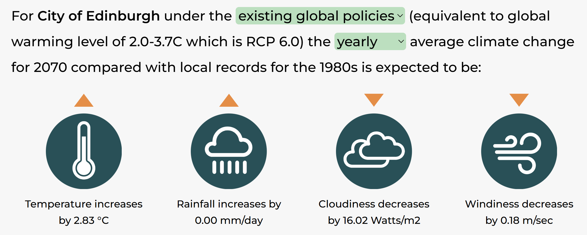

## Analysis By the Collective: D4CAE (Data for Climate Action Edinburgh)

add D4CAE logo!!!

add table of contents!!!

Published: add date!!!

# Introduction

## Scope

The aim of this report is to present key data on climate action happening, and climate impacts on, the city of Edinburgh in Scotland. As the output of a small voluntary local group, D4CAE, the scope is modest, addressing a handful of aspects of climate action and climate impacts.

## Open access

This report is an open science project - the data, code and text are all being produced in a publicly available repository on GitHub:

<https://github.com/data4climateactionedinburgh/abcd_2025>

Any amendments will be visible in this same GitHub repo, as commits, in the normal Git version control way. This report file, the text, and all the files in the repository are made available under a Creative Commons Zero v1.0 licence, except of course those subject to ownership by the respective data providers. The files created by D4CAE are thus placed in the public domain, and may be copied, adapted and redistributed without condition. If you wish to cite this work, please cite Data 4 Climate Action Edinburgh as the author.

## The group

D4CAE was set up by Pauline Ward, who is also the main contributor to this report. You can find our blog and contact details on our website:

<https://data-4-climate-action-edinburgh.github.io/home/>

# Temperature

The Met Office [annual summary of 2024](https://www.metoffice.gov.uk/binaries/content/assets/metofficegovuk/pdf/weather/learn-about/uk-past-events/summaries/annual_assessment_2024.pdf) temperature map shows Edinburgh and the surrounding area categorised as being in the 0.5 to 1.0 degrees celsius anomaly relating to the 1991 to 2020 period.

According to the Met Office's Local Climate Action Tool, the projected temperature increase for the City of Edinburgh, based on current policies, by 2070 is 2.83 degrees celsius.

# 

https://www.lcat.uk/

# Rainfall

# Travel

# Climate action

# References

Met Office (2025) "Annual Assessment - 2024" https://www.metoffice.gov.uk/binaries/content/assets/metofficegovuk/pdf/weather/learn-about/uk-past-events/summaries/annual_assessment_2024.pdf

https://www.lcat.uk/
